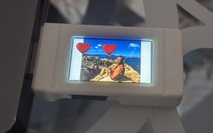

# RP2040-Geek PNG display

Just a base project to load PNG pictures from the SDCard and show them on the
RP2040-Geek display 240x135 pixels.



In order to use it you have to create an SDCard with a set of pictures in PNG format
resized as 240x135 pixels directly in the folder, then you have to create a
folder `effects` with a single 64x64 pixels image in PNG format with transparent background.
The effect image will appear after a while over the base image during the rendering 

Here the FAT32 filesystem example structure:

```
+
  + effects
      - heart.png (64 x 64 px)
  - 01.png (240 x 135 px)
  - 02.png (240 x 135 px)
  - 03.png (240 x 135 px)
```

## Build

```sh
mkdir -p build
cd build
cmake ..
make
```

## Deploy

Just upload the `u2f` file to the RP2040 as usual.

# Convert Images to 240x135 pixels

Just use `imagemagick`

```sh
convert example-image-c.png -resize 240x135 -gravity Center -extent 240x135 example-image-r.png
```

Install with

```sh
sudo apt install graphicsmagick-imagemagick-compat
```
